---

marp: true
math: katex
header: "01ゼミ 重みの初期値 / Batch Normalization"
footer: "by リュカ"
theme: 01semi
paginate: true

---

<!-- p178-189 -->
<!-- class: title  -->

# 6.2 重みの初期値
高柳海斗(リュカ)


---
<!-- class: slides  -->
# todo
batch Normalization の表が崩れているのを修正

---
<!-- class: slides  -->
# 重みの初期値
ニューラルネットワークの性能は初期値によっても左右される。

- よい初期値とは何か(初期値の望ましい性質)
  - 重みの値を小さくできれば、過学習を起きにくくできる
  - 小さい値からスタートするのがよいのでは?
  <!-- - 重みが大きくなると過学習を起こす傾向にある -->
  <!-- - 過学習を抑え汎化性能を高めたい -->

今まで使っていた初期値
```python
0.01 * np.random.randn(10, 100)
```

---
# 重みの初期値を0にする？
小さい値からスタートするのがよいならすべて0にしてしまえば良いのでは？→ 実は誤り
<!-- ネットワークは致命的な欠陥を抱えることになる -->

<div style="text-align:center;">

  

</div>


---


---


---
# なぜダメなのか
似たような役割を果たすニューロンがいるから

---
何恺明(フゥカイミン)