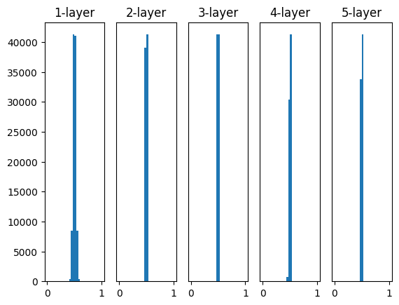
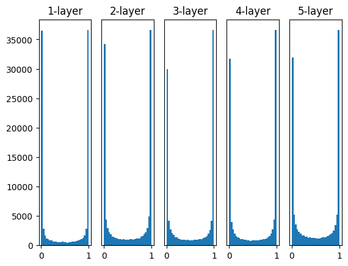
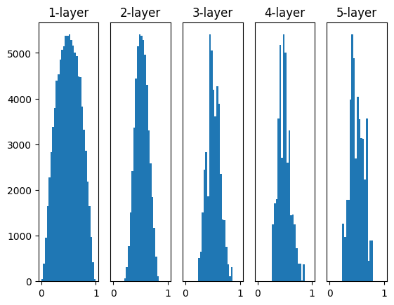
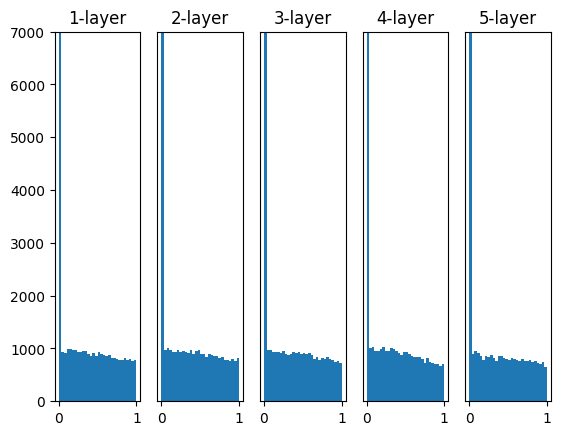
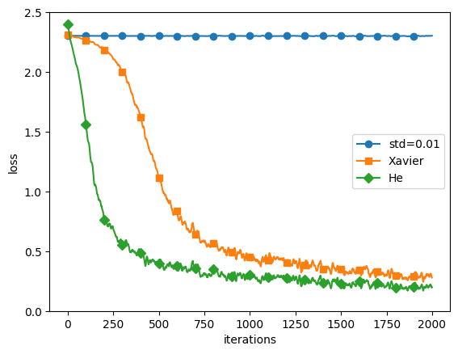

<!-- p178-189 -->
<!-- class: title  -->

# 6.2 重みの初期値
高柳海斗(リュカ)


---
<!-- class: slides  -->
# 重みの初期値
ニューラルネットワークの性能は初期値によっても左右される。

- よい初期値の考察
  - 重みが大きくなると過学習を起こす傾向にある
  - 小さい値からスタートするのがよいのでは?
  <!-- -  -->
  <!-- - 過学習を抑え汎化性能を高めたい -->

今まで使っていた初期値
```python
0.01 * np.random.randn(10, 100)
```

---
# 重みの初期値を0にする？
小さい値からスタートするのがよいならすべて0にしてしまえば良いのでは？→ 実は誤り
<!-- ネットワークは致命的な欠陥を抱えることになる -->
<div style = 'float:left;width:50%;'>

$w_1 = \sigma(a_1x + b_1)$
$w_2 = \sigma(a_2x + b_2)$
$y = \sigma(a_3w_1 + a_4w_2 + b_3)$
パラメータの初期値を0とする
対称性より
$
\frac{\partial L}{\partial a_1} = \frac{\partial L}{\partial a_2},
\frac{\partial L}{\partial a_3} = \frac{\partial L}{\partial a_4},
\frac{\partial L}{\partial b_1} = \frac{\partial L}{\partial b_2}
$

</div>
<div style = 'float:right;width:50%;text-align:center;'>

  
  単純なネットワーク

</div>

---
<div style="text-align:center;margin:0;">


</div>

---
<div style="text-align:center;">


</div>

---


正解を$t$として勾配を計算すると
<div style = 'float:left;width:50%;'>

$$
\begin{align*}
\frac{\partial L}{\partial a_1} 
&= x w_1(1-w_1)a_3(y-t)\\
\frac{\partial L}{\partial a_2} 
&= x w_2(1-w_2)a_4(y-t)\\
\frac{\partial L}{\partial a_3}
&= w_1(y-t)\\

\end{align*}
$$

</div>
<div style = 'float:right;width:50%;'>

$$
\begin{align*}
\frac{\partial L}{\partial a_4}
&= w_2(y-t)\\
\frac{\partial L}{\partial b_1} 
&= w_1(1-w_1)a_3(y-t)\\
\frac{\partial L}{\partial b_2} 
&= w_2(1-w_2)a_4(y-t)\\
\end{align*}
$$

</div>

初期値が$a_1 = a_2, a_3 = a_4, b_1 = b_2$を満たしていると対称性を保存してしまうことがわかる

ゆえに初期値にはある程度のランダム性が必要

---
# 隠れ層のアクティベーション分布
<!-- 大きすぎてもダメ、小さすぎてもダメならどのくらいがちょうどいいの？ -->
隠れ層のアクティベーション(活性化関数の後の出力データ)を観察することで初期値の良さを評価できる

<div style="text-align:center;float:right;width:50%;">


標準偏差0.01の正規分布

</div>
<div style="text-align:center;float:left;width:50%;">


標準偏差1の正規分布

</div>

ソースコード:`\src\weight_init_activation_histogram.ipynb`


---
# 勾配消失 (gradient vanishing)
<div style="float:left;width:50%;">

右の図を見ると各層のアクティベーションは0と1に偏った分布になっていることがわかる

シグモイド関数の両端では微分係数が0に近くなっており, 逆伝播での勾配の値が小さくなってしまうことから学習に時間がかかる

これを**勾配消失**という

</div>
<div style="text-align:center;float:right;width:50%;">


標準偏差1の正規分布

</div>

---
# 表現力の制限
<div style="float:left;width:50%;">

一方右の図を見ると0.5付近に集中していることが分かる

複数のニューロンがほとんど同じ値を出力するとすれば、(例で見たように)1個のニューロンでもほぼ同じことを表現できるため、ネットワークの表現力が落ちてしまう問題が起こる

</div>
<div style="text-align:center;float:right;width:50%;">


標準偏差0.01の正規分布

</div>

---
# Xavierの初期値
<div style="float:left;width:50%;">

Xavier Glorotらの論文で推奨されている初期値「Xavierの初期値」

- 分布:前層のノードの個数を$n$として、標準偏差$1/\sqrt{n}$の標準偏差

- 仮定:活性化関数は線形

- 適用:活性化関数にシグモイドやtanhを使っているとき

</div>
<div style="text-align:center;float:right;width:50%;">


Xavierの初期値

</div>

---
# Heの初期値
<div style="float:left;width:50%;">

Kaiming He(何恺明)らが提案した「Heの初期値」

- 分布:前層のノードの個数を$n$として、標準偏差$2/\sqrt{n}$の標準偏差

- 仮定:活性化関数はReLU

- 適用:活性化関数にReLUやその派生を使っているとき

</div>
<div style="text-align:center;float:right;width:50%;">


Heの初期値

</div>
<!-- 補足:勾配消失は層を増やしていくほどしんこくになる。reluにXavierの初期値を適用すると観察しやすい -->

---
# MNISTによる重み初期値の比較

<div style="float:left;width:50%;">

ソースコード:`\src\weight_init_compare.ipynb`

図を見るとHeの初期値が最も速く収束していて、Xavierはそこそこ、0.01の正規分布にいたってはほとんど学習できていないことがわかる

</div>
<div style="text-align:center;float:right;width:50%;">


初期値ごとのLossの推移

</div>